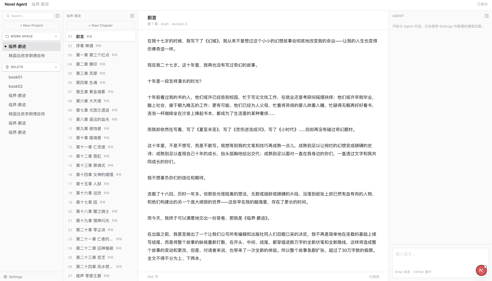
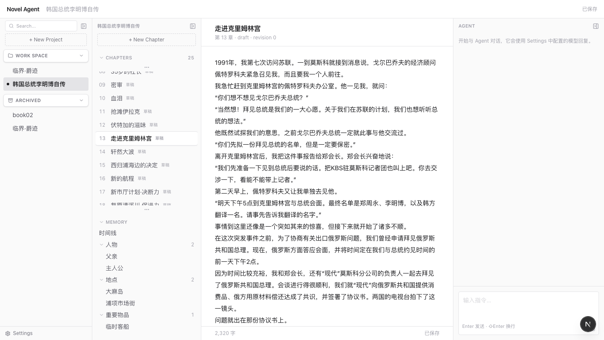
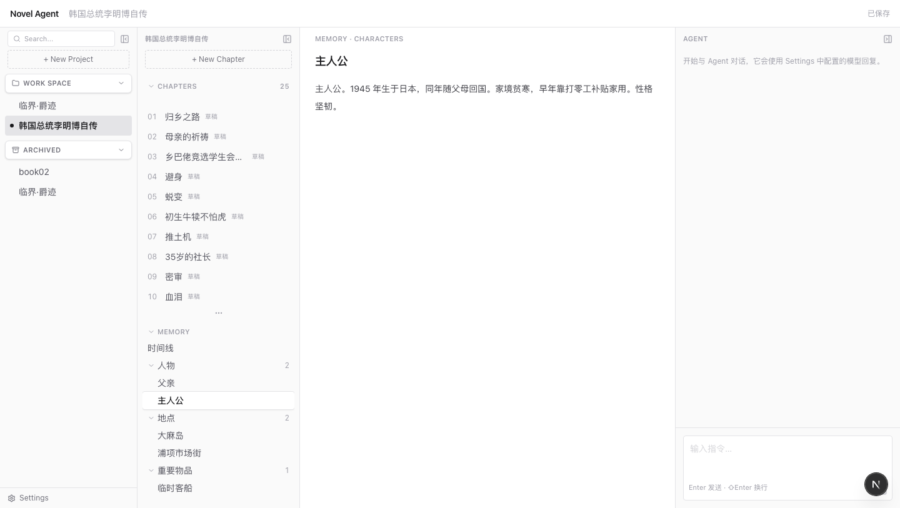

# NovelWriter

面向小说创作的 Agent / Harness 工程：以章节编辑器为中心、Agent 对话为辅助的写作工作台。



## 特性

| | |
|---|---|
| **编辑器优先** | 四栏工作台——项目 / 章节 / 正文 / Agent；侧栏可折叠，宽度可拖拽 |
| **章节栏** | 标题栏固定不动，列表自己滚；一屏约 10 章，两端用「⋯」表示还有内容 |
| **记忆目录** | 项目的 `memory/` 读成侧栏树（时间线 / 人物 / 地点 / 物品 / 生物），点开是只读预览 |
| **本地持久化** | SQLite 存元数据，正文以 Markdown 落盘；数据目录可放在仓库之外 |
| **自动保存** | 800ms 防抖写盘，携带 `revision` 做乐观并发校验，冲突时不触碰正文文件 |
| **URL 即状态** | `/projects/:projectId/chapters/:chapterId`，刷新或分享链接都能恢复现场 |
| **TXT 导入** | 按标题自动拆章；导入中途失败会回滚，不留半成品项目 |
| **Agent 对话** | 经 LiteLLM 网关调用模型；每次调用连同用量、耗时落 `llm_calls` |

章节栏：每个分组的标题栏固定在滚动容器之外，只有列表内容滚动；章节多时列表高度封顶在 10 行左右，滚动位置之外还有章节的那一端会亮起一行「⋯」。



记忆：`memory/` 下的目录结构即侧栏树，条目内容是只读预览——文件由「构建小说 memory」的 skill 生成，界面不提供编辑。文件不存在时侧栏计数为 0，预览显示空态。



## 快速开始

需要 Node.js 23.6 以上（开发与验证使用 26.x；代码依赖 `node:sqlite` 与默认开启的 TypeScript 类型剥离）。Agent 功能另需 Docker 跑 LiteLLM 网关。

### 应用

```bash
npm install
npm run dev
```

访问 http://localhost:3000。首启为空，点「+ New Project」新建，或导入 TXT。

### Agent（可选）

Agent 面板本身能打开，但要真正对话需要先起网关：

```bash
cp .env.example .env      # 填 OPENAI_API_KEY 与 OPENAI_MODEL_ID
docker compose up -d      # LiteLLM 监听 127.0.0.1:4000
```

再在应用左下角 **Settings** 里填网关地址与 Key。也可以用环境变量 `LITELLM_BASE_URL` / `LITELLM_API_KEY`，Settings 里保存的值优先。

## 常用命令

```bash
npm run dev      # 开发服务器
npm run build    # 生产构建
npm run lint     # ESLint
npm test         # node:test，无第三方测试依赖
```

## 数据放在哪

业务数据（SQLite 索引，以及各项目的 `project.json` 与 `chapters/*.md`）**不在仓库内**：

- 默认位置是仓库下的 `data/`；
- 可在左下角 **Settings → 数据目录** 改到任意绝对路径——例如另建一个仓库单独给稿件做版本控制；
- 生效位置记在仓库根的 `.novelwriter.json`，该文件已被 gitignore。

位置为什么记在文件而不是数据库：数据目录里装着 SQLite，而配置表 `app_settings` 就在那个 SQLite 里——把自己存进自己指向的位置，读不到。

## 目录结构

分层与依赖方向见[代码结构设计](docs/architecture/structure.md)，那是唯一权威定义。

```text
app/                         Next.js 路由、布局和全局样式
src/
├── actions/                 服务端 Action：UI 的唯一入口
├── ui/workspace/            工作台客户端组件
├── agent/                   Agent 运行时内核（与小说无关）
├── llm/                     模型调用契约、服务与 LiteLLM 适配
├── novel/                   小说业务：类型、仓储、TXT 导入与记忆读取
└── storage/                 SQLite 连接、迁移与数据目录解析
docs/
├── product/                 产品与交互设计
├── architecture/            Harness、数据和 LLM 架构
├── reviews/                 评审记录
├── pics/                    截图
├── references.md            外部参考资料
└── README.md                文档索引与维护约定
```

一条约束：`src/agent/` 永不 import `src/novel/`。小说内容通过 prompt、skill 与工具注入内核，见结构设计 §3。

## 文档

- [文档索引](docs/README.md)
- [代码结构设计](docs/architecture/structure.md)：分层与依赖方向的唯一权威定义
- [Web UI 产品设计](docs/product/web-ui.md)：布局、交互与 MVP 范围
- [Harness 数据结构总览](docs/architecture/data-model/overview.md)：数据模型主文档
- [LLM 模块设计](docs/architecture/llm.md)：调用契约、记录与安全约束
- [LLM 接入计划](docs/architecture/llm-integration-plan.md)：实施顺序与验收
- [Agent 对话 Context 设计](docs/architecture/agent-context.md)：一次请求里模型看到什么（设计提案，未实现）
- [Agent / Harness 层评审](docs/reviews/harness-review.md)：对照 `anthropics/commerce-agents` 的差距分析与优化建议

## 当前状态与已知边界

Web UI 处于交互原型阶段。Agent 已接入真实模型，但**对话尚未接地**——不会带上当前章节或项目设定，因此还回答不了"这一章讲了什么"。数据模型里设计的 Session / AgentRun / Generation / AgentEvent 尚未落库。下一步见[评审](docs/reviews/harness-review.md)的 P0-2。

记忆只做了一半：目录树与只读预览已经能用，但**生成记忆的 skill 还没写**，`memory/` 目前要靠手工或外部流程产出。

已知边界：

- 硬刷新或关标签页可能丢失最后 800ms 内的输入；
- 切换数据目录后整页重载，当前打开的章节不会自动恢复；
- 章节标题的 SoT 在 SQLite，正文的 SoT 在 `.md` 文件，两者无法共享一个原子事务。
